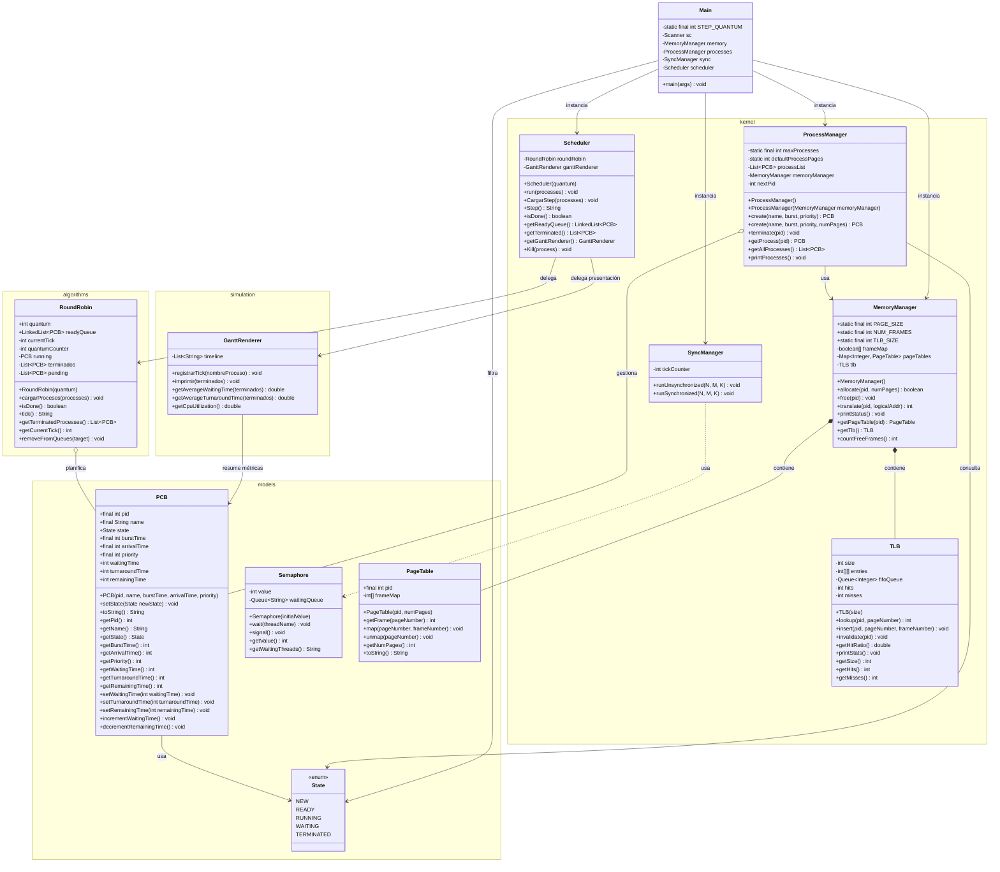

# Microkernel (Java)

A small, modular microkernel framework in Java providing a minimal core runtime and plugin/service extension points.

# UML Class Diagram

```mermaid
classDiagram
  direction TB

  namespace models {
    class State {
      <<enum>>
      NEW
      READY
      RUNNING
      WAITING
      TERMINATED
    }

    class PCB {
      +final int pid
      +final String name
      +State state
      +final int burstTime
      +final int arrivalTime
      +final int priority
      +int waitingTime
      +int turnaroundTime
      +int remainingTime
      +PCB(pid, name, burstTime, arrivalTime, priority)
      +setState(State newState) void
      +toString() String
      +getPid() int
      +getName() String
      +getState() State
      +getBurstTime() int
      +getArrivalTime() int
      +getPriority() int
      +getWaitingTime() int
      +getTurnaroundTime() int
      +getRemainingTime() int
      +setWaitingTime(int waitingTime) void
      +setTurnaroundTime(int turnaroundTime) void
      +setRemainingTime(int remainingTime) void
      +incrementWaitingTime() void
      +decrementRemainingTime() void
    }

    class Semaphore {
      -int value
      -Queue~String~ waitingQueue
      +Semaphore(initialValue)
      +wait(threadName) void
      +signal() void
      +getValue() int
      +getWaitingThreads() String
    }

    class PageTable {
      +final int pid
      -int[] frameMap
      +PageTable(pid, numPages)
      +getFrame(pageNumber) int
      +map(pageNumber, frameNumber) void
      +unmap(pageNumber) void
      +getNumPages() int
      +toString() String
    }
  }

  namespace kernel {
    class ProcessManager {
      -static final int maxProcesses
      -static int defaultProcessPages
      -List~PCB~ processList
      -MemoryManager memoryManager
      -int nextPid
      +ProcessManager()
      +ProcessManager(MemoryManager memoryManager)
      +create(name, burst, priority) PCB
      +create(name, burst, priority, numPages) PCB
      +terminate(pid) void
      +getProcess(pid) PCB
      +getAllProcesses() List~PCB~
      +printProcesses() void
    }

    class Scheduler {
      -RoundRobin roundRobin
      -GanttRenderer ganttRenderer
      +Scheduler(quantum)
      +run(processes) void
      +CargarStep(processes) void
      +Step() String
      +isDone() boolean
      +getReadyQueue() LinkedList~PCB~
      +getTerminated() List~PCB~
      +getGanttRenderer() GanttRenderer
      +Kill(process) void
    }

    class SyncManager {
      -int tickCounter
      +runUnsynchronized(N, M, K) void
      +runSynchronized(N, M, K) void
    }

    class MemoryManager {
      +static final int PAGE_SIZE
      +static final int NUM_FRAMES
      +static final int TLB_SIZE
      -boolean[] frameMap
      -Map~Integer, PageTable~ pageTables
      -TLB tlb
      +MemoryManager()
      +allocate(pid, numPages) boolean
      +free(pid) void
      +translate(pid, logicalAddr) int
      +printStatus() void
      +getPageTable(pid) PageTable
      +getTlb() TLB
      +countFreeFrames() int
    }

    class TLB {
      -int size
      -int[][] entries
      -Queue~Integer~ fifoQueue
      -int hits
      -int misses
      +TLB(size)
      +lookup(pid, pageNumber) int
      +insert(pid, pageNumber, frameNumber) void
      +invalidate(pid) void
      +getHitRatio() double
      +printStats() void
      +getSize() int
      +getHits() int
      +getMisses() int
    }
  }

  namespace algorithms {
    class RoundRobin {
      +int quantum
      +LinkedList~PCB~ readyQueue
      -int currentTick
      -int quantumCounter
      -PCB running
      -List~PCB~ terminados
      -List~PCB~ pending
      +RoundRobin(quantum)
      +cargarProcesos(processes) void
      +isDone() boolean
      +tick() String
      +getTerminatedProcesses() List~PCB~
      +getCurrentTick() int
      +removeFromQueues(target) void
    }
  }

  namespace simulation {
    class GanttRenderer {
      -List~String~ timeline
      +registrarTick(nombreProceso) void
      +imprimir(terminados) void
      +getAverageWaitingTime(terminados) double
      +getAverageTurnaroundTime(terminados) double
      +getCpuUtilization() double
    }
  }

  class Main {
    -static final int STEP_QUANTUM
    -Scanner sc
    -MemoryManager memory
    -ProcessManager processes
    -SyncManager sync
    -Scheduler scheduler
    +main(args) void
  }

  %% Relaciones models ──
  PCB --> State : usa

  %% Relaciones kernel ──
  ProcessManager o-- PCB : gestiona
  ProcessManager --> MemoryManager : usa
  ProcessManager --> State : consulta
  Scheduler --> RoundRobin : delega
  Scheduler --> GanttRenderer : delega presentación
  RoundRobin o-- PCB : planifica
  SyncManager ..> Semaphore : usa
  MemoryManager *-- TLB : contiene
  MemoryManager *-- PageTable : contiene

  %% Relaciones simulation ──
  GanttRenderer --> PCB : resume métricas

  %% Relaciones Main ──
  Main --> ProcessManager : instancia
  Main --> Scheduler : instancia
  Main --> SyncManager : instancia
  Main --> MemoryManager : instancia
  Main --> State : filtra
```

